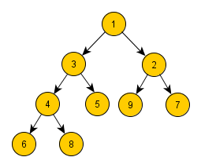

# Cvičení č. 5 – 30.10.2020

## Algoritmizace

### Haldy

[Užitečný text o haldách](https://turing.cz/~tom/efa/texty/20-heap.pdf)

Příklad min-haldy:

Uložení haldy z obrázku: `A = [1, 3, 2, 4, 5, 9, 7, 6, 8]`

**Úkol:** Zapište pseudokódem operace na min-haldě. Haldu máme uloženou v poli A, indexujeme od nuly.

*Pseudokód nemá pevně danou syntaxi; ze zápisu by ale mělo být jasné, jak kód přepsat do konkrétního programovacího jazyka.*

- Vrať index rodiče
- Vrať index levého potomka
- Vrať index pravého potomka
- Vlož nový prvek do haldy
- Vyextrahuj minimum z haldy
- Postav z pole haldu (předpokládáme, že se teď na začátku v poli A nachází prvky v náhodném pořadí).
- Setřiď pole od největšího prvku pomocí haldy (pro řazení od nejmenšího prvku bychom - použili max-haldu)

## Programování
- viz [kód](lab05.py)